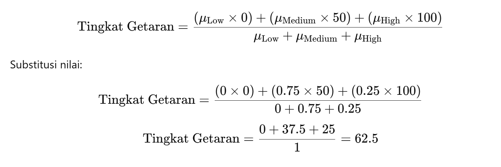

[**Final Report**](https://docs.google.com/document/d/16w8R1dKRgNFMuR6cA4rU3cRvRiVt9YY4tQtcmxnG3Sw/edit?usp=sharing)
---
[**Manual Book**](https://itsacid-my.sharepoint.com/:w:/g/personal/2040221039_student_its_ac_id/Ec_T2ujE5tBEoSvXXyO6w1EBvuIpxTd0Dnm1i2g7A4PJvg?e=O4dVZm)
---

### Swap MPU6050 & ADXL345
```
#include <Arduino.h>
#include <Adafruit_ADXL345_U.h>
#include <Adafruit_MPU6050.h>
#include <DHT.h>
#include <Wire.h>
#include <WiFi.h>
#include <HTTPClient.h>
#include <Adafruit_SSD1306.h>

#define DHTPIN 1
#define DHTTYPE DHT22
#define MPU6050_ADDRESS 0x68
#define ADXL345_ADDRESS 0x53
#define SDA 8
#define SCL 9
#define OLED_RESET 7
#define SCREEN_WIDTH 128
#define SCREEN_HEIGHT 32
#define SSD1306_I2C_ADDRESS 0x3C
#define STRAIN_GAUGE_PIN 20

Adafruit_SSD1306 display(SCREEN_WIDTH, SCREEN_HEIGHT, &Wire, OLED_RESET);
Adafruit_ADXL345_Unified adxl = Adafruit_ADXL345_Unified();
Adafruit_MPU6050 mpu;
DHT dht(DHTPIN, DHTTYPE);

float temperature = 0, humidity = 0;
float gyroX, gyroY, gyroZ, accelX, accelY, accelZ, strainValue;
unsigned long lastSensorReadTime = 0;
unsigned long lastDHTReadTime = 0;
unsigned long lastDisplayUpdateTime = 0;
const unsigned long sensorReadInterval = 200;
const unsigned long dhtReadInterval = 2000;
const unsigned long displayUpdateInterval = 2000;

// Display 
int displayIndex = 0;

// Fuzzy Variable
String vibrationStatus = "Unknown";

//Kalman variabel
float kalmanAccelX = 0, kalmanAccelY = 0, kalmanAccelZ = 0;
float kalmanGain = 0.5; // Simpla Gain
float processNoise = 0.1, measurementNoise = 1.0; // Variabel noise
float estimatedError = 1.0; // Variabel estimasi error

//WIFI
const char* ssid = "DTEO-VOKASI";
const char* password = "TEO123456";
// Fungsi untuk menghubungkan ke WiFi
void connectToWiFi()
{
  WiFi.begin(ssid, password);
  unsigned long startTime = millis();

  while (WiFi.status() != WL_CONNECTED)
  {
    delay(500);
    if (millis() - startTime > 2000) // Timeout 10 detik
    {
      Serial.println("WiFi gagal terhubung. Restarting...");
      ESP.restart();
    }
  }
  Serial.println("WiFi Terhubung!");
}

// Himpunan fuzzy untuk akselerasi
float membershipLow(float value) {
  return (value <= 1.0) ? 1.0 : (value >= 3.0 ? 0.0 : (3.0 - value) / 2.0);
}

float membershipMedium(float value) {
  return (value <= 2.0 || value >= 6.0) ? 0.0 : (value <= 4.0 ? (value - 2.0) / 2.0 : (6.0 - value) / 2.0);
}

float membershipHigh(float value) {
  return (value <= 4.0) ? 0.0 : (value >= 6.0 ? 1.0 : (value - 4.0) / 2.0);
}

// Fungsi parameter float inferensi fuzzy
float fuzzyInference(float accelValue) {

  float low = membershipLow(accelValue);
  float medium = membershipMedium(accelValue);
  float high = membershipHigh(accelValue);

  // fuzzy rule
  float noVibration = low;
  float slightVibration = medium;
  float strongVibration = high;

  // Defuzzifikasi menggunakan metode rata-rata berbobot
  return (noVibration * 0.0 + slightVibration * 50.0 + strongVibration * 100.0) /
         (noVibration + slightVibration + strongVibration);
}

// Decision-making getaran
String detectVibration(float accelValue) {
  float severity = fuzzyInference(accelValue);
  if (severity < 25.0) {
    return "No Vibration";
  } else if (severity < 75.0) {
    return "Slight Vibration";
  } else {
    return "Strong Vibration";
  }
}

float kalmanFilter(float measurement, float &estimatedValue, float &errorEstimate, float processNoise, float measurementNoise) {
  // Perhitungan gain Kalman
  kalmanGain = errorEstimate / (errorEstimate + measurementNoise);
  
  // Update estimasi nilai
  estimatedValue = estimatedValue + kalmanGain * (measurement - estimatedValue);

  // Update error estimasi
  errorEstimate = (1 - kalmanGain) * errorEstimate + fabs(estimatedValue) * processNoise;
  
  return estimatedValue;
}


// Fungsi membaca sensor DHT22
void readDHT()
{
  float temp = dht.readTemperature();
  float hum = dht.readHumidity();

  if (isnan(temp) || isnan(hum))
  {
    Serial.println("DHT Error: Menggunakan nilai terakhir.");
  }
  else
  {
    temperature = temp;
    humidity = hum;
  }
}

// Fungsi membaca data sensor MPU6050, ADXL345, dan strain gauge
void readSensors()
{
//   sensors_event_t a, g, temp;
//   mpu.getEvent(&a, &g, &temp);

//   gyroX = g.gyro.x;
//   gyroY = g.gyro.y;
//   gyroZ = g.gyro.z;

//   // Library Read param m/s2
//   // accelX = a.acceleration.x;
//   // accelY = a.acceleration.y;
//   // accelZ = a.acceleration.z;

//   // Kalman Param Filter
//   accelX = kalmanFilter(a.acceleration.x, kalmanAccelX, estimatedError, processNoise, measurementNoise);
//   accelY = kalmanFilter(a.acceleration.y, kalmanAccelY, estimatedError, processNoise, measurementNoise);
//   accelZ = kalmanFilter(a.acceleration.z, kalmanAccelZ, estimatedError, processNoise, measurementNoise);

//   int rawValue = analogRead(STRAIN_GAUGE_PIN);
//   strainValue = rawValue * (100.0 / 1023.0);
  
//   vibrationStatus = detectVibration(abs(accelZ)); // Deteksi getaran berdasarkan accelZ
//   vibrationStatus = detectVibration(abs(accelZ)); // Deteksi getaran berdasarkan accelZ

//   Serial.println("Vibration Status: " + vibrationStatus); // Tampilkan status getaran di Serial
// //Display.print(vibrationStatus)

  // ---== SWAP MPU6050 DAN ADXL345==----
  sensors_event_t g, temp;
  mpu.getEvent(nullptr, &g, &temp); //  gyro dari MPU6050

  gyroX = g.gyro.x;
  gyroY = g.gyro.y;
  gyroZ = g.gyro.z;

  // Baca akselerometer dari ADXL345
  sensors_event_t event;
  adxl.getEvent(&event);

  // Kalman Filter untuk ADXL345
  accelX = kalmanFilter(event.acceleration.x, kalmanAccelX, estimatedError, processNoise, measurementNoise);
  accelY = kalmanFilter(event.acceleration.y, kalmanAccelY, estimatedError, processNoise, measurementNoise);
  accelZ = kalmanFilter(event.acceleration.z, kalmanAccelZ, estimatedError, processNoise, measurementNoise);

  int rawValue = analogRead(STRAIN_GAUGE_PIN);
  strainValue = rawValue * (100.0 / 1023.0);

  vibrationStatus = detectVibration(abs(accelZ)); // Deteksi getaran berdasarkan accelZ
  Serial.println("Vibration Status: " + vibrationStatus); 
}


// Update tampilan OLED
void updateDisplay()
{
  display.clearDisplay(); // Clear Displat update
  display.setTextSize(1); // Ukuran teks standar
  display.setTextColor(SSD1306_WHITE); // Warna teks putih
  display.setCursor(0, 0); // Mulai dari pojok kiri atas

  switch (displayIndex)
  {
  case 0: // Data Gyroscope
    display.printf("Gyro X: %.2f deg/s\nGyro Y: %.2f deg/s\nGyro Z: %.2f deg/s", gyroX, gyroY, gyroZ);
    break;

  case 1: // Data Accelerometer
    display.printf("Accel X: %.2f m/s^2\nAccel Y: %.2f m/s^2\nAccel Z: %.2f m/s^2", accelX, accelY, accelZ);
    break;

  case 2: // Data Strain Gauge, Temperatur, dan Kelembaban
    display.printf("Strain: %.2f N\nTemp: %.2f C\nHumidity: %.2f %%", strainValue, temperature, humidity);
    break;

  case 3: // Status Getaran
    display.printf("Vibration Status:\n%s", vibrationStatus.c_str());
    break;

  }

  display.display(); 
  displayIndex = (displayIndex + 1) % 4; // Ganti layar berikutnya
}

// Kirim data ke server
void kirimDataKeServer()
{
  // HTTPClient http;
  // char postData[256];
  // snprintf(postData, sizeof(postData),
  //          "humidity=%.2f&temperature=%.2f&accelX=%.2f&accelY=%.2f&accelZ=%.2f&gyroX=%.2f&gyroY=%.2f&gyroZ=%.2f&strainValue=%.2f",
  //          humidity, temperature, accelX, accelY, accelZ, gyroX, gyroY, gyroZ, strainValue);

  // http.begin("http://192.168.54.36/shmsv2_2/sensor.php");
  // http.addHeader("Content-Type", "application/x-www-form-urlencoded");

  // int httpCode = http.POST(postData);
  // if (httpCode > 0)
  // {
  //   Serial.printf("HTTP Response code: %d\n", httpCode);
  //   String payload = http.getString();
  //   Serial.println(payload);
  // }
  // else
  // {
  //   Serial.printf("HTTP request gagal: %s\n", http.errorToString(httpCode).c_str());
  // }
  // http.end();
  HTTPClient http;
  char postData[256];
  snprintf(postData, sizeof(postData),
           "humidity=%.2f&temperature=%.2f&gyroX=%.2f&gyroY=%.2f&gyroZ=%.2f&accelX=%.2f&accelY=%.2f&accelZ=%.2f&strainValue=%.2f",
           humidity, temperature, accelX, accelY, accelZ, gyroX, gyroY, gyroZ, strainValue); // Swap MPU6050 (gyro) dan ADXL345 (accel)

  http.begin("http://192.168.54.36/shmsv2_2/sensor.php");
  http.addHeader("Content-Type", "application/x-www-form-urlencoded");

  int httpCode = http.POST(postData);
  if (httpCode > 0)
  {
    Serial.printf("HTTP Response code: %d\n", httpCode);
    String payload = http.getString();
    Serial.println(payload);
  }
  else
  {
    Serial.printf("HTTP request gagal: %s\n", http.errorToString(httpCode).c_str());
  }
  http.end();
}

// Setup program
void setup()
{
  Serial.begin(115200);
  Wire.begin(SDA, SCL);

  if (!display.begin(SSD1306_SWITCHCAPVCC, SSD1306_I2C_ADDRESS))
  {
    Serial.println("SSD1306 Gagal");
    while (true)
      ;
  }

  if (!mpu.begin())
    Serial.println("MPU6050 Tidak Terhubung");

  if (!adxl.begin())
    Serial.println("ADXL345 Tidak Terhubung");

  dht.begin();
  connectToWiFi();

  // Tampilkan pesan awal
  display.clearDisplay();
  display.setTextSize(1);
  display.setCursor(0, 0);
  display.println("Connected !!");
  display.print("SSID: ");
  display.println(ssid);
  display.println("Inisialisasi Selesai");
  display.display();
  delay(2000);
}

// Loop utama
void loop()
{
  unsigned long currentMillis = millis();

  if (WiFi.status() != WL_CONNECTED)
  {
    Serial.println("Reconnect WiFi ...");
    connectToWiFi();
  }

  if (currentMillis - lastDHTReadTime >= dhtReadInterval)
  {
    lastDHTReadTime = currentMillis;
    readDHT();
  }

  if (currentMillis - lastSensorReadTime >= sensorReadInterval)
  {
    lastSensorReadTime = currentMillis;
    readSensors();
    kirimDataKeServer();
  }

  if (currentMillis - lastDisplayUpdateTime >= displayUpdateInterval)
  {
    lastDisplayUpdateTime = currentMillis;
    updateDisplay();
  }
}
```




### Program Fuzzi + EKF Accelerometer

```
// Add Kalman Filter Reading MPU6050
#include <Arduino.h>
#include <Adafruit_ADXL345_U.h>
#include <Adafruit_MPU6050.h>
#include <DHT.h>
#include <Wire.h>
#include <WiFi.h>
#include <HTTPClient.h>
#include <Adafruit_SSD1306.h>

#define DHTPIN 1
#define DHTTYPE DHT22
#define MPU6050_ADDRESS 0x68
#define ADXL345_ADDRESS 0x53
#define SDA 8
#define SCL 9
#define OLED_RESET 7
#define SCREEN_WIDTH 128
#define SCREEN_HEIGHT 32
#define SSD1306_I2C_ADDRESS 0x3C
#define STRAIN_GAUGE_PIN 20

Adafruit_SSD1306 display(SCREEN_WIDTH, SCREEN_HEIGHT, &Wire, OLED_RESET);
Adafruit_ADXL345_Unified adxl = Adafruit_ADXL345_Unified();
Adafruit_MPU6050 mpu;
DHT dht(DHTPIN, DHTTYPE);

float temperature = 0, humidity = 0;
float gyroX, gyroY, gyroZ, accelX, accelY, accelZ, strainValue;
unsigned long lastSensorReadTime = 0;
unsigned long lastDHTReadTime = 0;
unsigned long lastDisplayUpdateTime = 0;
const unsigned long sensorReadInterval = 200;
const unsigned long dhtReadInterval = 2000;
const unsigned long displayUpdateInterval = 2000;

// Display 
int displayIndex = 0;

// Fuzzy Variable
String vibrationStatus = "Unknown";

//Kalman variabel
float kalmanAccelX = 0, kalmanAccelY = 0, kalmanAccelZ = 0;
float kalmanGain = 0.5; // Simpla Gain
float processNoise = 0.1, measurementNoise = 1.0; // Variabel noise
float estimatedError = 1.0; // Variabel estimasi error

//WIFI
const char* ssid = "DTEO-VOKASI";
const char* password = "TEO123456";
// Fungsi untuk menghubungkan ke WiFi
void connectToWiFi()
{
  WiFi.begin(ssid, password);
  unsigned long startTime = millis();

  while (WiFi.status() != WL_CONNECTED)
  {
    delay(500);
    if (millis() - startTime > 2000) // Timeout 10 detik
    {
      Serial.println("WiFi gagal terhubung. Restarting...");
      ESP.restart();
    }
  }
  Serial.println("WiFi Terhubung!");
}

// Himpunan fuzzy untuk akselerasi
float membershipLow(float value) {
  return (value <= 1.0) ? 1.0 : (value >= 3.0 ? 0.0 : (3.0 - value) / 2.0);
}

float membershipMedium(float value) {
  return (value <= 2.0 || value >= 6.0) ? 0.0 : (value <= 4.0 ? (value - 2.0) / 2.0 : (6.0 - value) / 2.0);
}

float membershipHigh(float value) {
  return (value <= 4.0) ? 0.0 : (value >= 6.0 ? 1.0 : (value - 4.0) / 2.0);
}

// Fungsi parameter float inferensi fuzzy
float fuzzyInference(float accelValue) {

  float low = membershipLow(accelValue);
  float medium = membershipMedium(accelValue);
  float high = membershipHigh(accelValue);

  // fuzzy rule
  float noVibration = low;
  float slightVibration = medium;
  float strongVibration = high;

  // Defuzzifikasi menggunakan metode rata-rata berbobot
  return (noVibration * 0.0 + slightVibration * 50.0 + strongVibration * 100.0) /
         (noVibration + slightVibration + strongVibration);
}

// Decision-making getaran
String detectVibration(float accelValue) {
  float severity = fuzzyInference(accelValue);
  if (severity < 25.0) {
    return "No Vibration";
  } else if (severity < 75.0) {
    return "Slight Vibration";
  } else {
    return "Strong Vibration";
  }
}

float kalmanFilter(float measurement, float &estimatedValue, float &errorEstimate, float processNoise, float measurementNoise) {
  // Perhitungan gain Kalman
  kalmanGain = errorEstimate / (errorEstimate + measurementNoise);
  
  // Update estimasi nilai
  estimatedValue = estimatedValue + kalmanGain * (measurement - estimatedValue);

  // Update error estimasi
  errorEstimate = (1 - kalmanGain) * errorEstimate + fabs(estimatedValue) * processNoise;
  
  return estimatedValue;
}


// Fungsi membaca sensor DHT22
void readDHT()
{
  float temp = dht.readTemperature();
  float hum = dht.readHumidity();

  if (isnan(temp) || isnan(hum))
  {
    Serial.println("DHT Error: Menggunakan nilai terakhir.");
  }
  else
  {
    temperature = temp;
    humidity = hum;
  }
}

// Fungsi membaca data sensor MPU6050, ADXL345, dan strain gauge
void readSensors()
{
  sensors_event_t a, g, temp;
  mpu.getEvent(&a, &g, &temp);

  gyroX = g.gyro.x;
  gyroY = g.gyro.y;
  gyroZ = g.gyro.z;

  // Library Read param m/s2
  // accelX = a.acceleration.x;
  // accelY = a.acceleration.y;
  // accelZ = a.acceleration.z;

  // Kalman Param Filter
  accelX = kalmanFilter(a.acceleration.x, kalmanAccelX, estimatedError, processNoise, measurementNoise);
  accelY = kalmanFilter(a.acceleration.y, kalmanAccelY, estimatedError, processNoise, measurementNoise);
  accelZ = kalmanFilter(a.acceleration.z, kalmanAccelZ, estimatedError, processNoise, measurementNoise);

  int rawValue = analogRead(STRAIN_GAUGE_PIN);
  strainValue = rawValue * (100.0 / 1023.0);
  
  vibrationStatus = detectVibration(abs(accelZ)); // Deteksi getaran berdasarkan accelZ
  vibrationStatus = detectVibration(abs(accelZ)); // Deteksi getaran berdasarkan accelZ

  Serial.println("Vibration Status: " + vibrationStatus); // Tampilkan status getaran di Serial
//Display.print(vibrationStatus)
}


// Update tampilan OLED
void updateDisplay()
{
  display.clearDisplay(); // Clear Displat update
  display.setTextSize(1); // Ukuran teks standar
  display.setTextColor(SSD1306_WHITE); // Warna teks putih
  display.setCursor(0, 0); // Mulai dari pojok kiri atas

  switch (displayIndex)
  {
  case 0: // Data Gyroscope
    display.printf("Gyro X: %.2f deg/s\nGyro Y: %.2f deg/s\nGyro Z: %.2f deg/s", gyroX, gyroY, gyroZ);
    break;

  case 1: // Data Accelerometer
    display.printf("Accel X: %.2f m/s^2\nAccel Y: %.2f m/s^2\nAccel Z: %.2f m/s^2", accelX, accelY, accelZ);
    break;

  case 2: // Data Strain Gauge, Temperatur, dan Kelembaban
    display.printf("Strain: %.2f N\nTemp: %.2f C\nHumidity: %.2f %%", strainValue, temperature, humidity);
    break;

  case 3: // Status Getaran
    display.printf("Vibration Status:\n%s", vibrationStatus.c_str());
    break;

  }

  display.display(); 
  displayIndex = (displayIndex + 1) % 4; // Ganti layar berikutnya
}

// Kirim data ke server
void kirimDataKeServer()
{
  HTTPClient http;
  char postData[256];
  snprintf(postData, sizeof(postData),
           "humidity=%.2f&temperature=%.2f&accelX=%.2f&accelY=%.2f&accelZ=%.2f&gyroX=%.2f&gyroY=%.2f&gyroZ=%.2f&strainValue=%.2f",
           humidity, temperature, accelX, accelY, accelZ, gyroX, gyroY, gyroZ, strainValue);

  http.begin("http://192.168.54.36/shmsv2_2/sensor.php");
  http.addHeader("Content-Type", "application/x-www-form-urlencoded");

  int httpCode = http.POST(postData);
  if (httpCode > 0)
  {
    Serial.printf("HTTP Response code: %d\n", httpCode);
    String payload = http.getString();
    Serial.println(payload);
  }
  else
  {
    Serial.printf("HTTP request gagal: %s\n", http.errorToString(httpCode).c_str());
  }
  http.end();
}

// Setup program
void setup()
{
  Serial.begin(115200);
  Wire.begin(SDA, SCL);

  if (!display.begin(SSD1306_SWITCHCAPVCC, SSD1306_I2C_ADDRESS))
  {
    Serial.println("SSD1306 Gagal");
    while (true)
      ;
  }

  if (!mpu.begin())
    Serial.println("MPU6050 Tidak Terhubung");

  if (!adxl.begin())
    Serial.println("ADXL345 Tidak Terhubung");

  dht.begin();
  connectToWiFi();

  // Tampilkan pesan awal
  display.clearDisplay();
  display.setTextSize(1);
  display.setCursor(0, 0);
  display.println("Connected !!");
  display.print("SSID: ");
  display.println(ssid);
  display.println("Inisialisasi Selesai");
  display.display();
  delay(2000);
}

// Loop utama
void loop()
{
  unsigned long currentMillis = millis();

  if (WiFi.status() != WL_CONNECTED)
  {
    Serial.println("Reconnect WiFi ...");
    connectToWiFi();
  }

  if (currentMillis - lastDHTReadTime >= dhtReadInterval)
  {
    lastDHTReadTime = currentMillis;
    readDHT();
  }

  if (currentMillis - lastSensorReadTime >= sensorReadInterval)
  {
    lastSensorReadTime = currentMillis;
    readSensors();
    kirimDataKeServer();
  }

  if (currentMillis - lastDisplayUpdateTime >= displayUpdateInterval)
  {
    lastDisplayUpdateTime = currentMillis;
    updateDisplay();
  }
}
```


### Program 19 November 2024
```
#include <Arduino.h>
#include <Adafruit_ADXL345_U.h>
#include <Adafruit_MPU6050.h>
#include <DHT.h>
#include <Wire.h>
#include <WiFi.h>
#include <HTTPClient.h>
#include <Adafruit_SSD1306.h>

// Define Floor and indicator
#define FLOOR_1 37
#define FLOOR_2 36
#define FLOOR_3 35
#define FLOOR_IND_1 38
#define FLOOR_IND_2 39
#define FLOOR_IND_3 40

// Additional constants for DB access
int lastLantai = 0;                                                 // Lantai terakhir ke db
bool stateBtn1 = LOW, stateBtn2 = LOW, stateBtn3 = LOW;             // Status tombol
bool lastStateBtn1 = LOW, lastStateBtn2 = LOW, lastStateBtn3 = LOW; // Status tombol sebelumnya

float temperature = 0, humidity = 0;
float temperatureState = temperature; // Handler last value
float humidityState = humidity;       // Handler last value

// Define PIN DHT22
#define DHTPIN 1
#define DHTTYPE DHT22

// Define MPU and ADXL
#define MPU6050_ADDRESS 0x68
#define ADXL345_ADDRESS 0x53
#define SDA 8
#define SCL 9

// Define LCD output
#define OLED_RESET 7 // RESET LCD output
#define SCREEN_WIDTH 128
#define SCREEN_HEIGHT 32
#define SSD1306_I2C_ADDRESS 0x3C

// Define Strain Gauge and Reset
#define STRAIN_GAUGE_PIN 20
#define RESET_BUTTON_PIN 4 // RESET All Instruments

Adafruit_SSD1306 display(SCREEN_WIDTH, SCREEN_HEIGHT, &Wire, OLED_RESET);
Adafruit_ADXL345_Unified adxl = Adafruit_ADXL345_Unified();
Adafruit_MPU6050 mpu;
DHT dht(DHTPIN, DHTTYPE);

unsigned long lastSensorReadTime = 0;
unsigned long lastDHTReadTime = 0;
unsigned long lastDisplayUpdateTime = 0;
const unsigned long sensorReadInterval = 200;     // Define 5hz interval 200ms
const unsigned long dhtReadInterval = 2000;       // Define 0.5hz interval 2s
const unsigned long displayUpdateInterval = 2000; // LCD Display Update Interval

int displayIndex = 0;
int updateCount = 0;

void kirimDataKeServer(float gyroX, float gyroY, float gyroZ, float accelX, float accelY, float accelZ, float strainValue, float temperature, float humidity);

void connectToWiFi()
{
  display.clearDisplay();
  display.setTextSize(1);
  display.setTextColor(SSD1306_WHITE);
  display.setCursor(0, 0);

  Serial.println("Connecting to DTEO-VOKASI ... ");
  display.println("Connecting to");
  display.println("\nDTEO-VOKASI ...");
  display.display();
  delay(1500);

  WiFi.begin("DTEO-VOKASI", "TEO123456");

  unsigned long startTime = millis();
  while (WiFi.status() != WL_CONNECTED)
  {
    if (millis() - startTime > 2000) // Re-connect 2s
    {
      //* DEBUG */
      // Serial.println("Failed connect WiFi");
      display.clearDisplay();
      display.setCursor(0, 0);
      display.println("WiFi Fail To Connect !!!");
      display.display();
      return;
    }
    delay(500);
  }

  //* DEBUG */
  // Serial.println("WiFi Connected !!!");
  // Serial.print("IP Address: ");
  // Serial.println(WiFi.localIP());

  display.clearDisplay();
  display.setCursor(0, 0);
  display.println("WiFi Connected !!!");
  display.print("DTEO-VOKASI");
  display.display();
  delay(1500);
}

void setup()
{
  Serial.begin(115200);
  Wire.begin(SDA, SCL);

  // Reset Pin Configuration
  pinMode(RESET_BUTTON_PIN, INPUT_PULLUP);

  // Floor Button Configuration
  // pinMode(FLOOR_1, INPUT);
  // pinMode(FLOOR_2, INPUT);
  // pinMode(FLOOR_3, INPUT);
  // Floor Button Indicator
  // pinMode(FLOOR_IND_1, OUTPUT);
  // pinMode(FLOOR_IND_2, OUTPUT);
  // pinMode(FLOOR_IND_3, OUTPUT);
  // digitalWrite(FLOOR_IND_1, LOW); // Normal mode Mati
  // digitalWrite(FLOOR_IND_2, LOW);
  // digitalWrite(FLOOR_IND_3, LOW);

  if (!display.begin(SSD1306_SWITCHCAPVCC, 0x3C))
  {
    Serial.println(F("SSD1306 Gagal"));
    for (;;)
      ;
  }

  //** ERROR HANDLER */
  adxl.begin(ADXL345_ADDRESS);
  mpu.begin(MPU6050_ADDRESS);
  dht.begin();
  if (!mpu.begin() && !adxl.begin())
  {
    Serial.println("MPU6050 Not Connected");
    Serial.println("ADXL345 Not Connected");
  }
  else
  {
    Serial.println("MPU6050 Connected");
    Serial.println("ADXL Connected");
  }

  connectToWiFi();
}

void readSensors(float &gyroX, float &gyroY, float &gyroZ, float &accelX, float &accelY, float &accelZ, float &strainValue)
{
  sensors_event_t a, g, temp;
  mpu.getEvent(&a, &g, &temp);
  gyroX = g.gyro.x;
  gyroY = g.gyro.y;
  gyroZ = g.gyro.z;
  accelX = a.acceleration.x;
  accelY = a.acceleration.y;
  accelZ = a.acceleration.z;

  int rawValue = analogRead(STRAIN_GAUGE_PIN);
  strainValue = rawValue * (100.0 / 1023.0);
}

void readDHT(float &temperature, float &humidity)
{
  temperature = dht.readTemperature();
  humidity = dht.readHumidity();

  //** ERROR HANDLER */
  if (isnan(temperature) || isnan(humidity))
  {
    Serial.println("DHT Sensor Error: NaN value");
  }
  else
  {
    temperatureState = temperature;
    humidityState = humidity;
  }
}

void kirimDataKeServer(float gyroX, float gyroY, float gyroZ, float accelX, float accelY, float accelZ, float strainValue, float temperature, float humidity) // int current Floor saya hapus
{
  HTTPClient http;
  WiFiClient client;
  String postData;

  // Construct POST data string
  postData = "humidity=" + String(humidity) +
             "&temperature=" + String(temperature) +
             "&accelX=" + String(accelX) +
             "&accelY=" + String(accelY) +
             "&accelZ=" + String(accelZ) +
             "&gyroX=" + String(gyroX) +
             "&gyroY=" + String(gyroY) +
             "&gyroZ=" + String(gyroZ) +
             "&strainValue=" + String(strainValue);
  //  "&lantai=" + String(lastLantai);

  // http.begin(client, "http://10.17.38.28/shmsv2_2/sensor.php"); // MODUL LAMA
  http.begin(client, "http://10.17.38.28/shmsv2_2/sensor2.php"); // MODUL BARU
  http.addHeader("Content-Type", "application/x-www-form-urlencoded");

  int httpCode = http.POST(postData); // request
  String payload = http.getString();  // payload

  Serial.println("HTTP Response code: " + String(httpCode));
  Serial.println("Server response: " + payload);

  http.end();
}

void updateDisplay(float gyroX, float gyroY, float gyroZ, float accelX, float accelY, float accelZ, float strainValue, float temperature, float humidity)
{
  if (updateCount < 3)
  {
    display.clearDisplay();
    display.setTextSize(1);
    display.setTextColor(SSD1306_WHITE);
    display.setCursor(0, 0);

    switch (displayIndex)
    {
    case 0:
      display.printf("Gyro X: %.2f deg/s", gyroX);
      display.printf("\nGyro Y: %.2f deg/s", gyroY);
      display.printf("\nGyro Z: %.2f deg/s", gyroZ);
      // digitalWrite(FLOOR_IND_1, HIGH);
      // digitalWrite(FLOOR_IND_2, LOW);
      // digitalWrite(FLOOR_IND_3, LOW);
      break;
    case 1:
      display.printf("Accel X: %.2f m/s^2", accelX);
      display.printf("\nAccel Y: %.2f m/s^2", accelY);
      display.printf("\nAccel Z: %.2f m/s^2", accelZ);
      // digitalWrite(FLOOR_IND_1, LOW);
      // digitalWrite(FLOOR_IND_2, HIGH);
      // digitalWrite(FLOOR_IND_3, LOW);
      break;
    case 2:
      display.printf("Strain  : %.2f N", strainValue);
      display.printf("\nTemp    : %.2f C", temperature);
      display.printf("\nHumidity: %.2f %%", humidity);
      // digitalWrite(FLOOR_IND_1, LOW);
      // digitalWrite(FLOOR_IND_2, LOW);
      // digitalWrite(FLOOR_IND_3, HIGH);
      break;
      // case 3:
      //   break;
    }

    display.display();
    displayIndex = (displayIndex + 1) % 3;
  }
}

void resetSensors(float &gyroX, float &gyroY, float &gyroZ, float &accelX, float &accelY, float &accelZ, float &strainValue, float &temperature, float &humidity)
{
  gyroX = gyroY = gyroZ = accelX = accelY = accelZ = strainValue = temperature = humidity = 0;

  display.clearDisplay();
  // display.setTextSize(1);
  // display.setTextColor(SSD1306_WHITE);
  display.setCursor(0, 0);
  display.printf("Reset Success");
  Serial.println("Reset Success");

  // static unsigned long lastBlinkTime = 0;
  // static int blinkState = LOW;
  // for (int i = 0; i < 4; i++)
  // {
  //   if (millis() - lastBlinkTime >= 500)
  //   {
  //     lastBlinkTime = millis();
  //     blinkState = !blinkState;
  //     digitalWrite(FLOOR_IND_1, blinkState);
  //   }
  // }
}

void loop()
{
  static float gyroX, gyroY, gyroZ, accelX, accelY, accelZ, strainValue;
  unsigned long currentMillis = millis();

  if (WiFi.status() != WL_CONNECTED)
  {
    Serial.println("Reconnect WiFi ...");
    connectToWiFi();
  }

  // RESET mu gurung kenek jancok
  if (digitalRead(RESET_BUTTON_PIN) == LOW)
  {
    resetSensors(gyroX, gyroY, gyroZ, accelX, accelY, accelZ, strainValue, temperature, humidity);
  }

  else
  {
    if (currentMillis - lastSensorReadTime >= 200) // saya ganti, sebelumnya lastDHTReadTime
    {
      lastDHTReadTime = currentMillis;
      readDHT(temperature, humidity);
    }

    // (5 Hz)
    if (currentMillis - lastSensorReadTime >= 200)
    {
      lastSensorReadTime = currentMillis;
      readSensors(gyroX, gyroY, gyroZ, accelX, accelY, accelZ, strainValue);
      kirimDataKeServer(gyroX, gyroY, gyroZ, accelX, accelY, accelZ, strainValue, temperatureState, humidityState); // lastLantai saya hapus
    }

    // * LCD Display *//
    if (currentMillis - lastDisplayUpdateTime >= displayUpdateInterval)
    {
      lastDisplayUpdateTime = currentMillis;
      updateDisplay(gyroX, gyroY, gyroZ, accelX, accelY, accelZ, strainValue, temperature, humidity); // int currentFloor saya hapus
    }
  }

  // stateBtn1 = digitalRead(FLOOR_1);
  // stateBtn2 = digitalRead(FLOOR_2);
  // stateBtn3 = digitalRead(FLOOR_3);

  // lastStateBtn1 = stateBtn1;
  // lastStateBtn2 = stateBtn2;
  // lastStateBtn3 = stateBtn3;
}
```


## Program sebelum Persentasi Progress
```
#include <Arduino.h>
#include <Adafruit_ADXL345_U.h>
#include <Adafruit_MPU6050.h>
#include <DHT.h>
#include <Wire.h>
#include <WiFi.h>
#include <HTTPClient.h>
#include <Adafruit_SSD1306.h>

// Define Floor and indicator
#define FLOOR_1 37
#define FLOOR_2 36
#define FLOOR_3 35
#define FLOOR_IND_1 38
#define FLOOR_IND_2 39
#define FLOOR_IND_3 40

// Additional constants for DB access
int lastLantai = 0;                                                 // Lantai terakhir ke db
bool stateBtn1 = LOW, stateBtn2 = LOW, stateBtn3 = LOW;             // Status tombol
bool lastStateBtn1 = LOW, lastStateBtn2 = LOW, lastStateBtn3 = LOW; // Status tombol sebelumnya

float temperature = 0, humidity = 0;
float temperatureState = temperature; // Handler last value
float humidityState = humidity;       // Handler last value

// Define PIN DHT22
#define DHTPIN 1
#define DHTTYPE DHT22

// Define MPU and ADXL
#define MPU6050_ADDRESS 0x68
#define ADXL345_ADDRESS 0x53
#define SDA 8
#define SCL 9

// Define LCD output
#define OLED_RESET 7 // RESET LCD output
#define SCREEN_WIDTH 128
#define SCREEN_HEIGHT 32
#define SSD1306_I2C_ADDRESS 0x3C

// Define Strain Gauge and Reset
#define STRAIN_GAUGE_PIN 20
#define RESET_BUTTON_PIN 2 // RESET All Instruments

Adafruit_SSD1306 display(SCREEN_WIDTH, SCREEN_HEIGHT, &Wire, OLED_RESET);
Adafruit_ADXL345_Unified adxl = Adafruit_ADXL345_Unified();
Adafruit_MPU6050 mpu;
DHT dht(DHTPIN, DHTTYPE);

unsigned long lastSensorReadTime = 0;
unsigned long lastDHTReadTime = 0;
unsigned long lastDisplayUpdateTime = 0;
const unsigned long sensorReadInterval = 200;     // Define 5hz interval 200ms
const unsigned long dhtReadInterval = 2000;       // Define 0.5hz interval 2s
const unsigned long displayUpdateInterval = 2000; // LCD Display Update Interval

int displayIndex = 0;
int updateCount = 0;

void kirimDataKeServer(float gyroX, float gyroY, float gyroZ, float accelX, float accelY, float accelZ, float strainValue, float temperature, float humidity);

void connectToWiFi()
{
  display.clearDisplay();
  display.setTextSize(1);
  display.setTextColor(SSD1306_WHITE);
  display.setCursor(0, 0);

  Serial.println("Connecting to DTEO-VOKASI ... ");
  display.println("Connecting to");
  display.println("\nDTEO-VOKASI ...");
  display.display();
  delay(1500);

  WiFi.begin("DTEO-VOKASI", "TEO123456");

  unsigned long startTime = millis();
  while (WiFi.status() != WL_CONNECTED)
  {
    if (millis() - startTime > 2000) // Re-connect 2s
    {
      //* DEBUG */
      // Serial.println("Failed connect WiFi");
      display.clearDisplay();
      display.setCursor(0, 0);
      display.println("WiFi Fail To Connect !!!");
      display.display();
      return;
    }
    delay(500);
  }

  //* DEBUG */
  // Serial.println("WiFi Connected !!!");
  // Serial.print("IP Address: ");
  // Serial.println(WiFi.localIP());

  display.clearDisplay();
  display.setCursor(0, 0);
  display.println("WiFi Connected !!!");
  display.print("DTEO-VOKASI");
  display.display();
  delay(1500);
}

void setup()
{
  Serial.begin(115200);
  Wire.begin(SDA, SCL);

  // Reset Pin Configuration
  pinMode(RESET_BUTTON_PIN, INPUT);

  // Floor Button Configuration
  pinMode(FLOOR_1, INPUT);
  pinMode(FLOOR_2, INPUT);
  pinMode(FLOOR_3, INPUT);
  // Floor Button Indicator
  pinMode(FLOOR_IND_1, OUTPUT);
  pinMode(FLOOR_IND_2, OUTPUT);
  pinMode(FLOOR_IND_3, OUTPUT);
  digitalWrite(FLOOR_IND_1, LOW); // Normal mode Mati
  digitalWrite(FLOOR_IND_2, LOW);
  digitalWrite(FLOOR_IND_3, LOW);

  if (!display.begin(SSD1306_SWITCHCAPVCC, 0x3C))
  {
    Serial.println(F("SSD1306 Gagal"));
    for (;;)
      ;
  }

  // if (!mpu.begin() && !adxl.begin()) {
  //   Serial.println("MPU6050 & ADXL345 failed to init.");
  // } else {
  //   Serial.println("MPU6050 & ADXL345 connect.");
  // }

  //** ERROR HANDLER */
  adxl.begin(ADXL345_ADDRESS);
  mpu.begin(MPU6050_ADDRESS);
  dht.begin();
  if (!mpu.begin() && !adxl.begin())
  {
    Serial.println("MPU6050 Not Connected");
    Serial.println("ADXL345 Not Connected");
  }
  else
  {
    Serial.println("MPU6050 Connected");
    Serial.println("ADXL Connected");
  }

  connectToWiFi();
}

void readSensors(float &gyroX, float &gyroY, float &gyroZ, float &accelX, float &accelY, float &accelZ, float &strainValue)
{
  sensors_event_t a, g, temp;
  mpu.getEvent(&a, &g, &temp);
  gyroX = g.gyro.x;
  gyroY = g.gyro.y;
  gyroZ = g.gyro.z;
  accelX = a.acceleration.x;
  accelY = a.acceleration.y;
  accelZ = a.acceleration.z;

  int rawValue = analogRead(STRAIN_GAUGE_PIN);
  strainValue = rawValue * (100.0 / 1023.0);
}

void readDHT(float &temperature, float &humidity)
{
  temperature = dht.readTemperature();
  humidity = dht.readHumidity();

  //** ERROR HANDLER */
  if (isnan(temperature) || isnan(humidity))
  {
    Serial.println("DHT Sensor Error: NaN value");
  }
  else
  {
    temperatureState = temperature;
    humidityState = humidity;
  }
}

void kirimDataKeServer(float gyroX, float gyroY, float gyroZ, float accelX, float accelY, float accelZ, float strainValue, float temperature, float humidity) // int current Floor saya hapus
{
  // Print sensor values to Serial
  // Serial.println("Data yang dikirim ke server:");
  // Serial.print("Floor: ");
  // Serial.println(currentFloor);
  // Serial.print("Gyro X: ");
  // Serial.println(gyroX);
  // Serial.print("Gyro Y: ");
  // Serial.println(gyroY);
  // Serial.print("Gyro Z: ");
  // Serial.println(gyroZ);
  // Serial.print("Accel X: ");
  // Serial.println(accelX);
  // Serial.print("Accel Y: ");
  // Serial.println(accelY);
  // Serial.print("Accel Z: ");
  // Serial.println(accelZ);
  // Serial.print("Strain Value: ");
  // Serial.println(strainValue);
  // Serial.print("Temperature: ");
  // Serial.println(temperature);
  // Serial.print("Humidity: ");
  // Serial.println(humidity);
  // Serial.println();

  HTTPClient http;
  WiFiClient client;
  String postData;

  // Construct POST data string
  postData = "humidity=" + String(humidity) +
             "&temperature=" + String(temperature) +
             "&accelX=" + String(accelX) +
             "&accelY=" + String(accelY) +
             "&accelZ=" + String(accelZ) +
             "&gyroX=" + String(gyroX) +
             "&gyroY=" + String(gyroY) +
             "&gyroZ=" + String(gyroZ) +
             "&strainValue=" + String(strainValue);
  //  "&lantai=" + String(lastLantai);

  http.begin(client, "http://10.17.37.202/shmsv2_2/sensor.php"); // MODUL LAMA
  // http.begin(client, "http://10.17.37.202/shmsv2_2/sensor.php2"); // MODUL BARU
  http.addHeader("Content-Type", "application/x-www-form-urlencoded");

  int httpCode = http.POST(postData); // request
  String payload = http.getString();  // payload

  Serial.println("HTTP Response code: " + String(httpCode));
  Serial.println("Server response: " + payload);

  http.end();
}

void updateDisplay(float gyroX, float gyroY, float gyroZ, float accelX, float accelY, float accelZ, float strainValue, float temperature, float humidity)
{
  if (updateCount < 3)
  {
    display.clearDisplay();
    display.setTextSize(1);
    display.setTextColor(SSD1306_WHITE);
    display.setCursor(0, 0);

    switch (displayIndex)
    {
    case 0:
      display.printf("Gyro X: %.2f deg/s", gyroX);
      display.printf("\nGyro Y: %.2f deg/s", gyroY);
      display.printf("\nGyro Z: %.2f deg/s", gyroZ);
      digitalWrite(FLOOR_IND_1, HIGH);
      digitalWrite(FLOOR_IND_2, LOW);
      digitalWrite(FLOOR_IND_3, LOW);
      break;
    case 1:
      display.printf("Accel X: %.2f m/s^2", accelX);
      display.printf("\nAccel Y: %.2f m/s^2", accelY);
      display.printf("\nAccel Z: %.2f m/s^2", accelZ);
      digitalWrite(FLOOR_IND_1, LOW);
      digitalWrite(FLOOR_IND_2, HIGH);
      digitalWrite(FLOOR_IND_3, LOW);
      break;
    case 2:
      display.printf("Strain  : %.2f N", strainValue);
      display.printf("\nTemp    : %.2f C", temperature);
      display.printf("\nHumidity: %.2f %%", humidity);
      digitalWrite(FLOOR_IND_1, LOW);
      digitalWrite(FLOOR_IND_2, LOW);
      digitalWrite(FLOOR_IND_3, HIGH);
      break;
      // case 3:
      //   display.printf("Floor: %d", currentFloor);
      //   break;
    }

    display.display();
    displayIndex = (displayIndex + 1) % 3;
  }
}

void resetSensors(float &gyroX, float &gyroY, float &gyroZ, float &accelX, float &accelY, float &accelZ, float &strainValue, float &temperature, float &humidity)
{
  gyroX = gyroY = gyroZ = accelX = accelY = accelZ = strainValue = temperature = humidity = 0;

  display.clearDisplay();
  // display.setTextSize(1);
  // display.setTextColor(SSD1306_WHITE);
  display.setCursor(0, 0);
  display.printf("Reset Success");

  Serial.println("Reset Success");

  digitalWrite(FLOOR_IND_1, 1);
  delayMicroseconds(1500);
  digitalWrite(FLOOR_IND_1, 0);
  delayMicroseconds(500);
  digitalWrite(FLOOR_IND_1, 1);
  delayMicroseconds(1500);
  digitalWrite(FLOOR_IND_1, 0);
  delayMicroseconds(500);

  //Debugging Device Calibration/
  // Serial.println(gyroX);
  // Serial.println(gyroY);
  // Serial.println(gyroZ);
  // Serial.println(accelX);
  // Serial.println(accelY);
  // Serial.println(accelZ);
  // Serial.println(strainValue);
  // Serial.println(temperature);
  // Serial.println(humidity);
}

void loop()
{
  static float gyroX, gyroY, gyroZ, accelX, accelY, accelZ, strainValue;
  unsigned long currentMillis = millis();

  // RESET mu gurung kenek jancok
  // if (digitalRead(RESET_BUTTON_PIN) == HIGH)
  // {
  //   resetSensors(gyroX, gyroY, gyroZ, accelX, accelY, accelZ, strainValue, temperature, humidity);
  // }

  if (WiFi.status() != WL_CONNECTED)
  {
    Serial.println("Reconnect WiFi ...");
    connectToWiFi();
  }

  stateBtn1 = digitalRead(FLOOR_1);
  stateBtn2 = digitalRead(FLOOR_2);
  stateBtn3 = digitalRead(FLOOR_3);

  /* // Current Floor SKIP jadi lewatnya DB 
    if (stateBtn1 == HIGH && lastStateBtn1 == LOW)
    {
      lastLantai = 1;
      digitalWrite(FLOOR_IND_1, HIGH);
      digitalWrite(FLOOR_IND_2, LOW);
      digitalWrite(FLOOR_IND_3, LOW);
    }
    else if (stateBtn2 == HIGH && lastStateBtn2 == LOW)
    {
      lastLantai = 2;
      digitalWrite(FLOOR_IND_1, LOW);
      digitalWrite(FLOOR_IND_2, HIGH);
      digitalWrite(FLOOR_IND_3, LOW);
    }
    else if (stateBtn3 == HIGH && lastStateBtn3 == LOW)
    {
      lastLantai = 3;
      digitalWrite(FLOOR_IND_1, LOW);
      digitalWrite(FLOOR_IND_2, LOW);
      digitalWrite(FLOOR_IND_3, HIGH);
    }

  */

  lastStateBtn1 = stateBtn1;
  lastStateBtn2 = stateBtn2;
  lastStateBtn3 = stateBtn3;

  // if (lastLantai < 1 || lastLantai > 3)
  // {
  //   Serial.println("Error reading");
  // }

  if (currentMillis - lastSensorReadTime >= 200) // saya ganti, sebelumnya lastDHTReadTime
  {
    lastDHTReadTime = currentMillis;
    readDHT(temperature, humidity);

    //======================Serial Monitor DEBUGGING Only
    // Serial.print("Temperature: ");
    // Serial.print(temperature);
    // Serial.print("\t Humidity: ");
    // Serial.println(humidity);
  }

  // (5 Hz)
  if (currentMillis - lastSensorReadTime >= 200)
  {
    lastSensorReadTime = currentMillis;
    readSensors(gyroX, gyroY, gyroZ, accelX, accelY, accelZ, strainValue);
    kirimDataKeServer(gyroX, gyroY, gyroZ, accelX, accelY, accelZ, strainValue, temperatureState, humidityState); // lastLantai saya hapus
  }

  // * LCD Display *//
  if (currentMillis - lastDisplayUpdateTime >= displayUpdateInterval)
  {
    lastDisplayUpdateTime = currentMillis;
    updateDisplay(gyroX, gyroY, gyroZ, accelX, accelY, accelZ, strainValue, temperature, humidity); // int currentFloor saya hapus
  }
}

// void loop()
// {
//   if (WiFi.status() != WL_CONNECTED)
//   {
//     Serial.println("Reconnect WiFi ...");
//     connectToWiFi();
//   }

//   // Cek state tombol lantai
//   stateBtn1 = digitalRead(FLOOR_1);
//   stateBtn2 = digitalRead(FLOOR_2);
//   stateBtn3 = digitalRead(FLOOR_3);

//   // Kondisi jika tombol lantai ditekan
//   if (stateBtn1 == HIGH && lastStateBtn1 == LOW)
//   {
//     lastLantai = 1;
//     digitalWrite(FLOOR_IND_1, HIGH);
//     digitalWrite(FLOOR_IND_2, LOW);
//     digitalWrite(FLOOR_IND_3, LOW);
//   }
//   else if (stateBtn2 == HIGH && lastStateBtn2 == LOW)
//   {
//     lastLantai = 2;
//     digitalWrite(FLOOR_IND_1, LOW);
//     digitalWrite(FLOOR_IND_2, HIGH);
//     digitalWrite(FLOOR_IND_3, LOW);
//   }
//   else if (stateBtn3 == HIGH && lastStateBtn3 == LOW)
//   {
//     lastLantai = 3;
//     digitalWrite(FLOOR_IND_1, LOW);
//     digitalWrite(FLOOR_IND_2, LOW);
//     digitalWrite(FLOOR_IND_3, HIGH);
//   }

//   lastStateBtn1 = stateBtn1;
//   lastStateBtn2 = stateBtn2;
//   lastStateBtn3 = stateBtn3;

//   if (lastLantai < 1 || lastLantai > 3)
//   {
//     Serial.println("Error reading");
//   }

//   static float gyroX, gyroY, gyroZ, accelX, accelY, accelZ, strainValue, temperature, humidity;
//   unsigned long currentMillis = millis();
//   if (digitalRead(RESET_BUTTON_PIN) == LOW)
//   {
//     resetSensors(gyroX, gyroY, gyroZ, accelX, accelY, accelZ, strainValue, temperature, humidity);
//   }
//   else
//   {
//     // Update sensor ADXL, MPU, dan strain gauge (5 Hz)
//     if (currentMillis - lastSensorReadTime >= sensorReadInterval)
//     {
//       lastSensorReadTime = currentMillis;
//       readSensors(gyroX, gyroY, gyroZ, accelX, accelY, accelZ, strainValue);

//       // Serial Monitor
//       Serial.print("\n");
//       Serial.print("Lantai: ");
//       Serial.println(lastLantai);
//       Serial.print("Gyro X: ");
//       Serial.print(gyroX);
//       Serial.print("\t Gyro Y: ");
//       Serial.print(gyroY);
//       Serial.print("\t Gyro Z: ");
//       Serial.println(gyroZ);
//       Serial.print("Accel X: ");
//       Serial.print(accelX);
//       Serial.print("\t Accel Y: ");
//       Serial.print(accelY);
//       Serial.print("\t Accel Z: ");
//       Serial.println(accelZ);
//       Serial.print("Strain Value: ");
//       Serial.println(strainValue);
//     }

//     // Update DHT Sensor (0.5 Hz)
//     if (currentMillis - lastDHTReadTime >= dhtReadInterval)
//     {
//       lastDHTReadTime = currentMillis;
//       readDHT(temperature, humidity);

//       // Serial Monitor
//       Serial.print("Temperature: ");
//       Serial.print(temperature);
//       Serial.print("\t Humidity: ");
//       Serial.println(humidity);
//       Serial.print("\n");

//       // Kirim data ke server
//       kirimDataKeServer(gyroX, gyroY, gyroZ, accelX, accelY, accelZ, strainValue, temperature, humidity, lastLantai);
//     }

//     // Update OLED Display (2 Hz)
//     if (currentMillis - lastDisplayUpdateTime >= displayUpdateInterval)
//     {
//       lastDisplayUpdateTime = currentMillis;
//       updateDisplay(gyroX, gyroY, gyroZ, accelX, accelY, accelZ, strainValue, temperature, humidity, lastLantai);
//     }
//   }
// }

//=====================FIX DB SENDER=============================
// ===============================================================
```

## Buffering DB data

```
#include <Arduino.h>
#include <Adafruit_ADXL345_U.h>
#include <Adafruit_MPU6050.h>
#include <DHT.h>
#include <Wire.h>
#include <WiFi.h>
#include <HTTPClient.h>
#include <Adafruit_SSD1306.h>

// Define Floor and indicator
#define FLOOR_1 35
#define FLOOR_2 36
#define FLOOR_3 37
#define FLOOR_IND_1 38
#define FLOOR_IND_2 39
#define FLOOR_IND_3 40
// Additional constants for DB access
int lastLantai = 0;                                                 // Lantai terakhir ke db
bool stateBtn1 = LOW, stateBtn2 = LOW, stateBtn3 = LOW;             // Status tombol
bool lastStateBtn1 = LOW, lastStateBtn2 = LOW, lastStateBtn3 = LOW; // Status tombol sebelumnya

// Define PIN DHT22
#define DHTPIN 1
#define DHTTYPE DHT22

// Define MPU and ADXL
#define MPU6050_ADDRESS 0x68
#define ADXL345_ADDRESS 0x53
#define SDA 8
#define SCL 9

// Define LCD output
#define OLED_RESET 7 // RESET LCD output
#define SCREEN_WIDTH 128
#define SCREEN_HEIGHT 32
#define SSD1306_I2C_ADDRESS 0x3C

// Define Strain Gauge and Reset
#define STRAIN_GAUGE_PIN 20
#define RESET_BUTTON_PIN 2 // RESET All Instruments

Adafruit_SSD1306 display(SCREEN_WIDTH, SCREEN_HEIGHT, &Wire, OLED_RESET);
Adafruit_ADXL345_Unified adxl = Adafruit_ADXL345_Unified();
Adafruit_MPU6050 mpu;
DHT dht(DHTPIN, DHTTYPE);

unsigned long lastSensorReadTime = 0;
unsigned long lastDHTReadTime = 0;
unsigned long lastDisplayUpdateTime = 0;
const unsigned long sensorReadInterval = 200;     // Define 5hz interval
const unsigned long dhtReadInterval = 2000;       // Define 0.5hz interval
const unsigned long displayUpdateInterval = 2000; // LCD Display Update Interval

int displayIndex = 0;

void kirimDataKeServer(float gyroX, float gyroY, float gyroZ, float accelX, float accelY, float accelZ, float strainValue, float temperature, float humidity);

void connectToWiFi()
{
  display.clearDisplay();
  display.setTextSize(1);
  display.setTextColor(SSD1306_WHITE);
  display.setCursor(0, 0);

  Serial.println("Connecting to DTEO-VOKASI ... ");
  display.println("Connecting to");
  display.println("\nDTEO-VOKASI ...");
  display.display();
  delay(1500);

  WiFi.begin("DTEO-VOKASI", "TEO123456");

  unsigned long startTime = millis();
  while (WiFi.status() != WL_CONNECTED)
  {
    if (millis() - startTime > 10000) // Re-connect 10s
    {
      Serial.println("Failed connect WiFi");
      display.clearDisplay();
      display.setCursor(0, 0);
      display.println("WiFi Fail To Connect !!!");
      display.display();
      return;
    }
    delay(500);
  }

  Serial.println("WiFi Connected !!!");
  Serial.print("IP Address: ");
  Serial.println(WiFi.localIP());

  display.clearDisplay();
  display.setCursor(0, 0);
  display.println("WiFi Connected !!!");
  display.print("DTEO-VOKASI");
  display.display();
  delay(1500);
}

void setup()
{
  Serial.begin(115200);
  Wire.begin(SDA, SCL);

  // Reset Pin Configuration
  pinMode(RESET_BUTTON_PIN, INPUT_PULLUP);

  // Floor Button Configuration
  pinMode(FLOOR_1, INPUT);
  pinMode(FLOOR_2, INPUT);
  pinMode(FLOOR_3, INPUT);
  // Floor Button Indicator
  pinMode(FLOOR_IND_1, OUTPUT);
  pinMode(FLOOR_IND_2, OUTPUT);
  pinMode(FLOOR_IND_3, OUTPUT);
  digitalWrite(FLOOR_IND_1, LOW); // Normal mode Mati
  digitalWrite(FLOOR_IND_2, LOW);
  digitalWrite(FLOOR_IND_3, LOW);

  if (!display.begin(SSD1306_SWITCHCAPVCC, 0x3C))
  {
    Serial.println(F("SSD1306 Gagal"));
    for (;;)
      ;
  }
  adxl.begin(ADXL345_ADDRESS);
  mpu.begin(MPU6050_ADDRESS);
  dht.begin();
  if (!mpu.begin() && !adxl.begin())
  {
    Serial.println("MPU6050 Not Connected");
    Serial.println("ADXL345 Not Connected");
  }
  else
  {
    Serial.println("MPU6050 Connected");
    Serial.println("ADXL Connected");
  }

  connectToWiFi();
}

void readSensors(float &gyroX, float &gyroY, float &gyroZ, float &accelX, float &accelY, float &accelZ, float &strainValue)
{
  sensors_event_t a, g, temp;
  mpu.getEvent(&a, &g, &temp);
  gyroX = g.gyro.x;
  gyroY = g.gyro.y;
  gyroZ = g.gyro.z;
  accelX = a.acceleration.x;
  accelY = a.acceleration.y;
  accelZ = a.acceleration.z;

  int rawValue = analogRead(STRAIN_GAUGE_PIN);
  strainValue = rawValue * (100.0 / 1023.0);
}

void readDHT(float &temperature, float &humidity)
{
  temperature = dht.readTemperature();
  humidity = dht.readHumidity();
}

void kirimDataKeServer(float gyroX, float gyroY, float gyroZ, float accelX, float accelY, float accelZ, float strainValue, float temperature, float humidity, int currentFloor)
{
  // Print sensor values to Serial
  Serial.println("Data yang dikirim ke server:");
  Serial.print("Floor: ");
  Serial.println(currentFloor);
  Serial.print("Gyro X: ");
  Serial.println(gyroX);
  Serial.print("Gyro Y: ");
  Serial.println(gyroY);
  Serial.print("Gyro Z: ");
  Serial.println(gyroZ);
  Serial.print("Accel X: ");
  Serial.println(accelX);
  Serial.print("Accel Y: ");
  Serial.println(accelY);
  Serial.print("Accel Z: ");
  Serial.println(accelZ);
  Serial.print("Strain Value: ");
  Serial.println(strainValue);
  Serial.print("Temperature: ");
  Serial.println(temperature);
  Serial.print("Humidity: ");
  Serial.println(humidity);
  Serial.println();

  HTTPClient http;
  WiFiClient client;
  String postData;

  // Construct POST data string
  postData = "humidity=" + String(humidity) +
             "&temperature=" + String(temperature) +
             "&accelX=" + String(accelX) +
             "&accelY=" + String(accelY) +
             "&accelZ=" + String(accelZ) +
             "&gyroX=" + String(gyroX) +
             "&gyroY=" + String(gyroY) +
             "&gyroZ=" + String(gyroZ) +
             "&strainValue=" + String(strainValue) +
             "&lantai=" + String(lastLantai);

  http.begin(client, "http://10.17.36.176/shmsv2_2/sensor.php");
  http.addHeader("Content-Type", "application/x-www-form-urlencoded");

  int httpCode = http.POST(postData); // Send the request
  String payload = http.getString();  // Get the response payload

  Serial.println("HTTP Response code: " + String(httpCode));
  Serial.println("Server response: " + payload);

  http.end();
}

void updateDisplay(float gyroX, float gyroY, float gyroZ, float accelX, float accelY, float accelZ, float strainValue, float temperature, float humidity, int currentFloor)
{
  display.clearDisplay();
  display.setTextSize(1);
  display.setTextColor(SSD1306_WHITE);
  display.setCursor(0, 0);

  switch (displayIndex)
  {
  case 0:
    display.printf("Gyro X: %.2f deg/s", gyroX);
    display.printf("\nGyro Y: %.2f deg/s", gyroY);
    display.printf("\nGyro Z: %.2f deg/s", gyroZ);
    break;
  case 1:
    display.printf("Accel X: %.2f m/s^2", accelX);
    display.printf("\nAccel Y: %.2f m/s^2", accelY);
    display.printf("\nAccel Z: %.2f m/s^2", accelZ);
    break;
  case 2:
    display.printf("Strain  : %.2f N", strainValue);
    display.printf("\nTemp    : %.2f C", temperature);
    display.printf("\nHumidity: %.2f %%", humidity);
    break;
  case 3:
    display.printf("Floor: %d", currentFloor);
    break;
  }

  display.display();
  displayIndex = (displayIndex + 1) % 4;
}

void resetSensors(float &gyroX, float &gyroY, float &gyroZ, float &accelX, float &accelY, float &accelZ, float &strainValue, float &temperature, float &humidity)
{
  gyroX = gyroY = gyroZ = accelX = accelY = accelZ = strainValue = temperature = humidity = 0;
  display.clearDisplay();
  display.display();
}

void loop()
{
  static float gyroX, gyroY, gyroZ, accelX, accelY, accelZ, strainValue;
  static float temperature = 0, humidity = 0;
  unsigned long currentMillis = millis();

  if (digitalRead(RESET_BUTTON_PIN) == LOW)
  {
    resetSensors(gyroX, gyroY, gyroZ, accelX, accelY, accelZ, strainValue, temperature, humidity);
  }

  if (WiFi.status() != WL_CONNECTED)
  {
    Serial.println("Reconnect WiFi ...");
    connectToWiFi();
  }

  stateBtn1 = digitalRead(FLOOR_1);
  stateBtn2 = digitalRead(FLOOR_2);
  stateBtn3 = digitalRead(FLOOR_3);

  if (stateBtn1 == HIGH && lastStateBtn1 == LOW)
  {
    lastLantai = 1;
    digitalWrite(FLOOR_IND_1, HIGH);
    digitalWrite(FLOOR_IND_2, LOW);
    digitalWrite(FLOOR_IND_3, LOW);
  }
  else if (stateBtn2 == HIGH && lastStateBtn2 == LOW)
  {
    lastLantai = 2;
    digitalWrite(FLOOR_IND_1, LOW);
    digitalWrite(FLOOR_IND_2, HIGH);
    digitalWrite(FLOOR_IND_3, LOW);
  }
  else if (stateBtn3 == HIGH && lastStateBtn3 == LOW)
  {
    lastLantai = 3;
    digitalWrite(FLOOR_IND_1, LOW);
    digitalWrite(FLOOR_IND_2, LOW);
    digitalWrite(FLOOR_IND_3, HIGH);
  }

  lastStateBtn1 = stateBtn1;
  lastStateBtn2 = stateBtn2;
  lastStateBtn3 = stateBtn3;

  if (lastLantai < 1 || lastLantai > 3)
  {
    Serial.println("Error reading");
  }

  if (currentMillis - lastDHTReadTime >= 2000)
  {
    lastDHTReadTime = currentMillis;
    readDHT(temperature, humidity);

    //======================Serial Monitor DEBUGGING Only
    // Serial.print("Temperature: ");
    // Serial.print(temperature);
    // Serial.print("\t Humidity: ");
    // Serial.println(humidity);
  }

  // (5 Hz)
  if (currentMillis - lastSensorReadTime >= 200)
  {
    lastSensorReadTime = currentMillis;
    readSensors(gyroX, gyroY, gyroZ, accelX, accelY, accelZ, strainValue);

    kirimDataKeServer(gyroX, gyroY, gyroZ, accelX, accelY, accelZ, strainValue, temperature, humidity, lastLantai);

    //==============Serial Monitor DEBUGGING ONLY
    // Serial.print("\n");
    // Serial.print("Lantai: ");
    // Serial.println(lastLantai);
    // Serial.print("Gyro X: ");
    // Serial.print(gyroX);
    // Serial.print("\t Gyro Y: ");
    // Serial.print(gyroY);
    // Serial.print("\t Gyro Z: ");
    // Serial.println(gyroZ);
    // Serial.print("Accel X: ");
    // Serial.print(accelX);
    // Serial.print("\t Accel Y: ");
    // Serial.print(accelY);
    // Serial.print("\t Accel Z: ");
    // Serial.println(accelZ);
    // Serial.print("Strain Value: ");
    // Serial.println(strainValue);
  }

  //LCD Display
  if (currentMillis - lastDisplayUpdateTime >= displayUpdateInterval)
  {
    lastDisplayUpdateTime = currentMillis;
    updateDisplay(gyroX, gyroY, gyroZ, accelX, accelY, accelZ, strainValue, temperature, humidity, lastLantai);
  }
}

// void loop()
// {
//   if (WiFi.status() != WL_CONNECTED)
//   {
//     Serial.println("Reconnect WiFi ...");
//     connectToWiFi();
//   }

//   // Cek state tombol lantai
//   stateBtn1 = digitalRead(FLOOR_1);
//   stateBtn2 = digitalRead(FLOOR_2);
//   stateBtn3 = digitalRead(FLOOR_3);

//   // Kondisi jika tombol lantai ditekan
//   if (stateBtn1 == HIGH && lastStateBtn1 == LOW)
//   {
//     lastLantai = 1;
//     digitalWrite(FLOOR_IND_1, HIGH);
//     digitalWrite(FLOOR_IND_2, LOW);
//     digitalWrite(FLOOR_IND_3, LOW);
//   }
//   else if (stateBtn2 == HIGH && lastStateBtn2 == LOW)
//   {
//     lastLantai = 2;
//     digitalWrite(FLOOR_IND_1, LOW);
//     digitalWrite(FLOOR_IND_2, HIGH);
//     digitalWrite(FLOOR_IND_3, LOW);
//   }
//   else if (stateBtn3 == HIGH && lastStateBtn3 == LOW)
//   {
//     lastLantai = 3;
//     digitalWrite(FLOOR_IND_1, LOW);
//     digitalWrite(FLOOR_IND_2, LOW);
//     digitalWrite(FLOOR_IND_3, HIGH);
//   }

//   lastStateBtn1 = stateBtn1;
//   lastStateBtn2 = stateBtn2;
//   lastStateBtn3 = stateBtn3;

//   if (lastLantai < 1 || lastLantai > 3)
//   {
//     Serial.println("Error reading");
//   }

//   static float gyroX, gyroY, gyroZ, accelX, accelY, accelZ, strainValue, temperature, humidity;
//   unsigned long currentMillis = millis();
//   if (digitalRead(RESET_BUTTON_PIN) == LOW)
//   {
//     resetSensors(gyroX, gyroY, gyroZ, accelX, accelY, accelZ, strainValue, temperature, humidity);
//   }
//   else
//   {
//     // Update sensor ADXL, MPU, dan strain gauge (5 Hz)
//     if (currentMillis - lastSensorReadTime >= sensorReadInterval)
//     {
//       lastSensorReadTime = currentMillis;
//       readSensors(gyroX, gyroY, gyroZ, accelX, accelY, accelZ, strainValue);

//       // Serial Monitor
//       Serial.print("\n");
//       Serial.print("Lantai: ");
//       Serial.println(lastLantai);
//       Serial.print("Gyro X: ");
//       Serial.print(gyroX);
//       Serial.print("\t Gyro Y: ");
//       Serial.print(gyroY);
//       Serial.print("\t Gyro Z: ");
//       Serial.println(gyroZ);
//       Serial.print("Accel X: ");
//       Serial.print(accelX);
//       Serial.print("\t Accel Y: ");
//       Serial.print(accelY);
//       Serial.print("\t Accel Z: ");
//       Serial.println(accelZ);
//       Serial.print("Strain Value: ");
//       Serial.println(strainValue);
//     }

//     // Update DHT Sensor (0.5 Hz)
//     if (currentMillis - lastDHTReadTime >= dhtReadInterval)
//     {
//       lastDHTReadTime = currentMillis;
//       readDHT(temperature, humidity);

//       // Serial Monitor
//       Serial.print("Temperature: ");
//       Serial.print(temperature);
//       Serial.print("\t Humidity: ");
//       Serial.println(humidity);
//       Serial.print("\n");

//       // Kirim data ke server
//       kirimDataKeServer(gyroX, gyroY, gyroZ, accelX, accelY, accelZ, strainValue, temperature, humidity, lastLantai);
//     }

//     // Update OLED Display (2 Hz)
//     if (currentMillis - lastDisplayUpdateTime >= displayUpdateInterval)
//     {
//       lastDisplayUpdateTime = currentMillis;
//       updateDisplay(gyroX, gyroY, gyroZ, accelX, accelY, accelZ, strainValue, temperature, humidity, lastLantai);
//     }
//   }
// }

//=====================FIX DB SENDER=============================
// ===============================================================

```

## Low Memory Solution

```
#include <Arduino.h>
#include <Adafruit_ADXL345_U.h>
#include <Adafruit_MPU6050.h>
#include <DHT.h>
#include <Wire.h>
#include <WiFi.h>
#include <HTTPClient.h>
#include <Adafruit_SSD1306.h>

// Define Floor and indicator
#define FLOOR_1 35
#define FLOOR_2 36
#define FLOOR_3 37
#define FLOOR_IND_1 38
#define FLOOR_IND_2 39
#define FLOOR_IND_3 40
// Additional constants for DB access
int lastLantai = 0;                                                 // Lantai terakhir ke db
bool stateBtn1 = LOW, stateBtn2 = LOW, stateBtn3 = LOW;             // Status tombol
bool lastStateBtn1 = LOW, lastStateBtn2 = LOW, lastStateBtn3 = LOW; // Status tombol sebelumnya

// Define PIN DHT22
#define DHTPIN 1
#define DHTTYPE DHT22

// Define MPU and ADXL
#define MPU6050_ADDRESS 0x68
#define ADXL345_ADDRESS 0x53
#define SDA 8
#define SCL 9

// Define LCD output
#define OLED_RESET 7 // RESET LCD output
#define SCREEN_WIDTH 128
#define SCREEN_HEIGHT 32
#define SSD1306_I2C_ADDRESS 0x3C

// Define Strain Gauge and Reset
#define STRAIN_GAUGE_PIN 20
#define RESET_BUTTON_PIN 2 // RESET All Instruments

Adafruit_SSD1306 display(SCREEN_WIDTH, SCREEN_HEIGHT, &Wire, OLED_RESET);
Adafruit_ADXL345_Unified adxl = Adafruit_ADXL345_Unified();
Adafruit_MPU6050 mpu;
DHT dht(DHTPIN, DHTTYPE);

unsigned long lastSensorReadTime = 0;
unsigned long lastDHTReadTime = 0;
unsigned long lastDisplayUpdateTime = 0;
const unsigned long sensorReadInterval = 200;     // Define 5hz interval
const unsigned long dhtReadInterval = 2000;       // Define 0.5hz interval
const unsigned long displayUpdateInterval = 2000; // LCD Display Update Interval

int displayIndex = 0;

void kirimDataKeServer(float gyroX, float gyroY, float gyroZ, float accelX, float accelY, float accelZ, float strainValue, float temperature, float humidity);

void connectToWiFi()
{
  display.clearDisplay();
  display.setTextSize(1);
  display.setTextColor(SSD1306_WHITE);
  display.setCursor(0, 0);

  Serial.println("Connecting to DTEO-VOKASI ... ");
  display.println("Connecting to");
  display.println("\nDTEO-VOKASI ...");
  display.display();
  delay(1500);

  WiFi.begin("DTEO-VOKASI", "TEO123456");

  unsigned long startTime = millis();
  while (WiFi.status() != WL_CONNECTED)
  {
    if (millis() - startTime > 10000) // Re-connect 10s
    {
      Serial.println("Failed connect WiFi");
      display.clearDisplay();
      display.setCursor(0, 0);
      display.println("WiFi Fail To Connect !!!");
      display.display();
      return;
    }
    delay(500);
  }

  Serial.println("WiFi Connected !!!");
  Serial.print("IP Address: ");
  Serial.println(WiFi.localIP());

  display.clearDisplay();
  display.setCursor(0, 0);
  display.println("WiFi Connected !!!");
  display.print("DTEO-VOKASI");
  display.display();
  delay(1500);
}

void setup()
{
  Serial.begin(115200);
  Wire.begin(SDA, SCL);

  // Reset Pin Configuration
  pinMode(RESET_BUTTON_PIN, INPUT_PULLUP);

  // Floor Button Configuration
  pinMode(FLOOR_1, INPUT);
  pinMode(FLOOR_2, INPUT);
  pinMode(FLOOR_3, INPUT);
  // Floor Button Indicator
  pinMode(FLOOR_IND_1, OUTPUT);
  pinMode(FLOOR_IND_2, OUTPUT);
  pinMode(FLOOR_IND_3, OUTPUT);
  digitalWrite(FLOOR_IND_1, LOW); // Normal mode Mati
  digitalWrite(FLOOR_IND_2, LOW);
  digitalWrite(FLOOR_IND_3, LOW);

  if (!display.begin(SSD1306_SWITCHCAPVCC, 0x3C))
  {
    Serial.println(F("SSD1306 Gagal"));
    for (;;)
      ;
  }
  adxl.begin(ADXL345_ADDRESS);
  mpu.begin(MPU6050_ADDRESS);
  dht.begin();
  if (!mpu.begin() && !adxl.begin())
  {
    Serial.println("MPU6050 Not Connected");
    Serial.println("ADXL345 Not Connected");
  }
  else
  {
    Serial.println("MPU6050 Connected");
    Serial.println("ADXL Connected");
  }

  connectToWiFi();
}

void readSensors(float &gyroX, float &gyroY, float &gyroZ, float &accelX, float &accelY, float &accelZ, float &strainValue)
{
  sensors_event_t a, g, temp;
  mpu.getEvent(&a, &g, &temp);
  gyroX = g.gyro.x;
  gyroY = g.gyro.y;
  gyroZ = g.gyro.z;
  accelX = a.acceleration.x;
  accelY = a.acceleration.y;
  accelZ = a.acceleration.z;

  int rawValue = analogRead(STRAIN_GAUGE_PIN);
  strainValue = rawValue * (100.0 / 1023.0);
}

void readDHT(float &temperature, float &humidity)
{
  temperature = dht.readTemperature();
  humidity = dht.readHumidity();
}

void kirimDataKeServer(float gyroX, float gyroY, float gyroZ, float accelX, float accelY, float accelZ, float strainValue, float temperature, float humidity, int currentFloor)
{
  // Print sensor values to Serial
  Serial.println("Data yang dikirim ke server:");
  Serial.print("Floor: ");
  Serial.println(currentFloor);
  Serial.print("Gyro X: ");
  Serial.println(gyroX);
  Serial.print("Gyro Y: ");
  Serial.println(gyroY);
  Serial.print("Gyro Z: ");
  Serial.println(gyroZ);
  Serial.print("Accel X: ");
  Serial.println(accelX);
  Serial.print("Accel Y: ");
  Serial.println(accelY);
  Serial.print("Accel Z: ");
  Serial.println(accelZ);
  Serial.print("Strain Value: ");
  Serial.println(strainValue);
  Serial.print("Temperature: ");
  Serial.println(temperature);
  Serial.print("Humidity: ");
  Serial.println(humidity);
  Serial.println();

  HTTPClient http;
  WiFiClient client;
  String postData;

  // Construct POST data string
  postData = "humidity=" + String(humidity) +
             "&temperature=" + String(temperature) +
             "&accelX=" + String(accelX) +
             "&accelY=" + String(accelY) +
             "&accelZ=" + String(accelZ) +
             "&gyroX=" + String(gyroX) +
             "&gyroY=" + String(gyroY) +
             "&gyroZ=" + String(gyroZ) +
             "&strainValue=" + String(strainValue) +
             "&lantai=" + String(lastLantai);

  http.begin(client, "http://10.17.36.176/shmsv2_2/sensor.php");
  http.addHeader("Content-Type", "application/x-www-form-urlencoded");

  int httpCode = http.POST(postData); // Send the request
  String payload = http.getString();  // Get the response payload

  Serial.println("HTTP Response code: " + String(httpCode));
  Serial.println("Server response: " + payload);

  http.end();
}

void updateDisplay(float gyroX, float gyroY, float gyroZ, float accelX, float accelY, float accelZ, float strainValue, float temperature, float humidity, int currentFloor)
{
  display.clearDisplay();
  display.setTextSize(1);
  display.setTextColor(SSD1306_WHITE);
  display.setCursor(0, 0);

  switch (displayIndex)
  {
  case 0:
    display.printf("Gyro X: %.2f deg/s", gyroX);
    display.printf("\nGyro Y: %.2f deg/s", gyroY);
    display.printf("\nGyro Z: %.2f deg/s", gyroZ);
    break;
  case 1:
    display.printf("Accel X: %.2f m/s^2", accelX);
    display.printf("\nAccel Y: %.2f m/s^2", accelY);
    display.printf("\nAccel Z: %.2f m/s^2", accelZ);
    break;
  case 2:
    display.printf("Strain  : %.2f N", strainValue);
    display.printf("\nTemp    : %.2f C", temperature);
    display.printf("\nHumidity: %.2f %%", humidity);
    break;
  case 3:
    display.printf("Floor: %d", currentFloor);
    break;
  }

  display.display();
  displayIndex = (displayIndex + 1) % 4;
}

void resetSensors(float &gyroX, float &gyroY, float &gyroZ, float &accelX, float &accelY, float &accelZ, float &strainValue, float &temperature, float &humidity)
{
  gyroX = gyroY = gyroZ = accelX = accelY = accelZ = strainValue = temperature = humidity = 0;
  display.clearDisplay();
  display.display();
}

void loop()
{
  if (WiFi.status() != WL_CONNECTED)
  {
    Serial.println("Reconnect WiFi ...");
    connectToWiFi();
  }

  // Cek state tombol lantai
  stateBtn1 = digitalRead(FLOOR_1);
  stateBtn2 = digitalRead(FLOOR_2);
  stateBtn3 = digitalRead(FLOOR_3);

  // Kondisi jika tombol lantai ditekan
  if (stateBtn1 == HIGH && lastStateBtn1 == LOW)
  {
    lastLantai = 1;
    digitalWrite(FLOOR_IND_1, HIGH);
    digitalWrite(FLOOR_IND_2, LOW);
    digitalWrite(FLOOR_IND_3, LOW);
  }
  else if (stateBtn2 == HIGH && lastStateBtn2 == LOW)
  {
    lastLantai = 2;
    digitalWrite(FLOOR_IND_1, LOW);
    digitalWrite(FLOOR_IND_2, HIGH);
    digitalWrite(FLOOR_IND_3, LOW);
  }
  else if (stateBtn3 == HIGH && lastStateBtn3 == LOW)
  {
    lastLantai = 3;
    digitalWrite(FLOOR_IND_1, LOW);
    digitalWrite(FLOOR_IND_2, LOW);
    digitalWrite(FLOOR_IND_3, HIGH);
  }

  lastStateBtn1 = stateBtn1;
  lastStateBtn2 = stateBtn2;
  lastStateBtn3 = stateBtn3;

  if (lastLantai < 1 || lastLantai > 3)
  {
    Serial.println("Error reading");
  }

  static float gyroX, gyroY, gyroZ, accelX, accelY, accelZ, strainValue, temperature, humidity;
  unsigned long currentMillis = millis();
  if (digitalRead(RESET_BUTTON_PIN) == LOW)
  {
    resetSensors(gyroX, gyroY, gyroZ, accelX, accelY, accelZ, strainValue, temperature, humidity);
  }
  else
  {
    // Update sensor ADXL, MPU, dan strain gauge (5 Hz)
    if (currentMillis - lastSensorReadTime >= sensorReadInterval)
    {
      lastSensorReadTime = currentMillis;
      readSensors(gyroX, gyroY, gyroZ, accelX, accelY, accelZ, strainValue);

      // Serial Monitor
      Serial.print("\n");
      Serial.print("Lantai: ");
      Serial.println(lastLantai);
      Serial.print("Gyro X: ");
      Serial.print(gyroX);
      Serial.print("\t Gyro Y: ");
      Serial.print(gyroY);
      Serial.print("\t Gyro Z: ");
      Serial.println(gyroZ);
      Serial.print("Accel X: ");
      Serial.print(accelX);
      Serial.print("\t Accel Y: ");
      Serial.print(accelY);
      Serial.print("\t Accel Z: ");
      Serial.println(accelZ);
      Serial.print("Strain Value: ");
      Serial.println(strainValue);
    }

    // Update DHT Sensor (0.5 Hz)
    if (currentMillis - lastDHTReadTime >= dhtReadInterval)
    {
      lastDHTReadTime = currentMillis;
      readDHT(temperature, humidity);

      // Serial Monitor
      Serial.print("Temperature: ");
      Serial.print(temperature);
      Serial.print("\t Humidity: ");
      Serial.println(humidity);
      Serial.print("\n");

      // Kirim data ke server
      kirimDataKeServer(gyroX, gyroY, gyroZ, accelX, accelY, accelZ, strainValue, temperature, humidity, lastLantai);
    }

    // Update OLED Display (2 Hz)
    if (currentMillis - lastDisplayUpdateTime >= displayUpdateInterval)
    {
      lastDisplayUpdateTime = currentMillis;
      updateDisplay(gyroX, gyroY, gyroZ, accelX, accelY, accelZ, strainValue, temperature, humidity, lastLantai);
    }
  }
}

```

## Multitask optimization

```

#include <Wire.h>
#include <WiFi.h>
#include <HTTPClient.h>
#include <Adafruit_MPU6050.h>
#include <Adafruit_ADXL345_U.h>
#include <DHT.h>

#define DHTPIN 1
#define DHTTYPE DHT22
#define MPU6050_ADDRESS 0x68
#define ADXL345_ADDRESS 0x53
#define STRAIN_GAUGE_PIN 10
#define SDA_PIN 8
#define SCL_PIN 9
#define RESET_BUTTON 2
#define OLED_RESET 7

DHT dht(DHTPIN, DHTTYPE);
Adafruit_MPU6050 mpu;
Adafruit_ADXL345_Unified adxl = Adafruit_ADXL345_Unified(12345);

TaskHandle_t sensorTaskHandle;
TaskHandle_t wifiTaskHandle;

char ssid[] = "DTEO-VOKASI";
char password[] = "TEO123456";
unsigned long lastDHT22 = 0;
unsigned long lastSensorRead = 0;

float gyroX, gyroY, gyroZ;
float accelX, accelY, accelZ;
int strainValue;
int temperature, humidity;

void setup() {
  Wire.begin(SDA_PIN, SCL_PIN);
  Serial.begin(115200);
  
  pinMode(RESET_BUTTON, INPUT_PULLUP);

  if (!mpu.begin(MPU6050_ADDRESS)) {
    Serial.println("MPU6050 failed to initialize!");
    while (1);
  }

  if (!adxl.begin()) {
    Serial.println("ADXL345 failed to initialize!");
    while (1);
  }

  dht.begin();
  connectToWiFi();

  xTaskCreatePinnedToCore(sensorTask, "SensorTask", 2000, NULL, 1, &sensorTaskHandle, 1);
  xTaskCreatePinnedToCore(wifiTask, "WiFiTask", 2000, NULL, 1, &wifiTaskHandle, 0);
}

void loop() {
  if (digitalRead(RESET_BUTTON) == LOW) {
    resetSensors();
  }
  delay(100);
}

void sensorTask(void *parameter) {
  while (1) {
    if (millis() - lastSensorRead >= 200) {
      readMPU6050();
      readADXL345();
      readStrainGauge();
      lastSensorRead = millis();
    }
    
    if (millis() - lastDHT22 >= 2000) {
      readDHT22();
      lastDHT22 = millis();
    }

    printToSerial();
    vTaskDelay(200 / portTICK_PERIOD_MS);
  }
}

void wifiTask(void *parameter) {
  while (1) {
    sendDataToServer();
    vTaskDelay(5000 / portTICK_PERIOD_MS);
  }
}

void connectToWiFi() {
  WiFi.begin(ssid, password);
  while (WiFi.status() != WL_CONNECTED) {
    delay(1000);
  }
  Serial.println("WiFi connected!");
}

void readMPU6050() {
  sensors_event_t a, g, temp;
  mpu.getEvent(&a, &g, &temp);
  gyroX = g.gyro.x * 100;  // converting to int for lighter data processing
  gyroY = g.gyro.y * 100;
  gyroZ = g.gyro.z * 100;
}

void readADXL345() {
  sensors_event_t event;
  adxl.getEvent(&event);
  accelX = event.acceleration.x * 100;
  accelY = event.acceleration.y * 100;
  accelZ = event.acceleration.z * 100;
}

void readStrainGauge() {
  strainValue = analogRead(STRAIN_GAUGE_PIN);
}

void readDHT22() {
  temperature = dht.readTemperature() * 100;  // Converting to int for lighter data
  humidity = dht.readHumidity() * 100;
}

void sendDataToServer() {
  if (WiFi.status() != WL_CONNECTED) {
    connectToWiFi();
  }
  
  HTTPClient http;
  http.begin("http://10.17.38.92/WebsiteMonitoring/SHMS");
  http.addHeader("Content-Type", "application/json");

  char jsonData[256];
  sprintf(jsonData, "{\"gyroX\":%d,\"gyroY\":%d,\"gyroZ\":%d,\"accelX\":%d,\"accelY\":%d,\"accelZ\":%d,\"strain\":%d,\"temperature\":%d,\"humidity\":%d}",
          (int)gyroX, (int)gyroY, (int)gyroZ, (int)accelX, (int)accelY, (int)accelZ, strainValue, temperature, humidity);
  
  int httpResponseCode = http.POST(jsonData);
  if (httpResponseCode > 0) {
    Serial.printf("Data sent successfully: %s\n", jsonData);
  } else {
    Serial.printf("Failed to send data, code: %d\n", httpResponseCode);
  }
  http.end();
}

void printToSerial() {
  Serial.print("Gyro X: ");
  Serial.print(gyroX / 100.0);
  Serial.println(" rad/s");
  Serial.print("Gyro Y: ");
  Serial.print(gyroY / 100.0);
  Serial.println(" rad/s");
  Serial.print("Gyro Z: ");
  Serial.print(gyroZ / 100.0);
  Serial.println(" rad/s");

  Serial.print("Accel X: ");
  Serial.print(accelX / 100.0);
  Serial.println(" m/s^2");
  Serial.print("Accel Y: ");
  Serial.print(accelY / 100.0);
  Serial.println(" m/s^2");
  Serial.print("Accel Z: ");
  Serial.print(accelZ / 100.0);
  Serial.println(" m/s^2");

  Serial.print("Strain: ");
  Serial.println(strainValue);

  Serial.print("Temp: ");
  Serial.print(temperature / 100.0);
  Serial.println(" C");

  Serial.print("Humidity: ");
  Serial.print(humidity / 100.0);
  Serial.println(" %");
}

void resetSensors() {
  ESP.restart();
}

```
[**paper**](
https://www.semanticscholar.org/paper/A-LOW-COST-MULTI-SENSOR-SYSTEM-FOR-INVESTIGATING-OF-And%C3%B2-Baglio/7070324640aee1fcc0311496376c54b0eb590707)